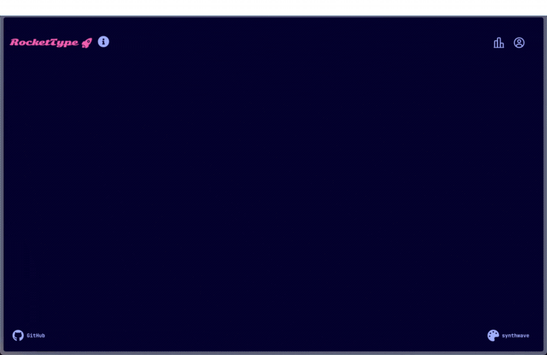
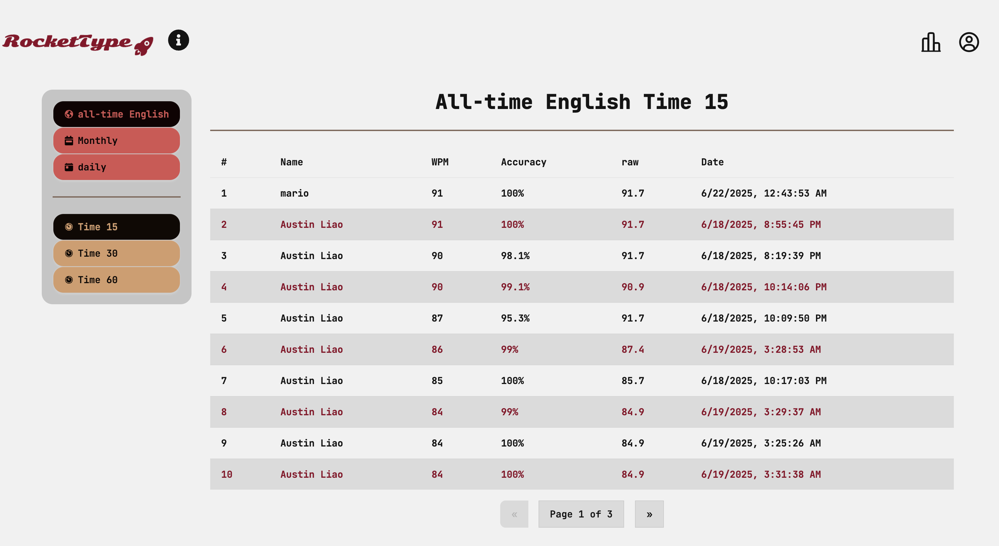
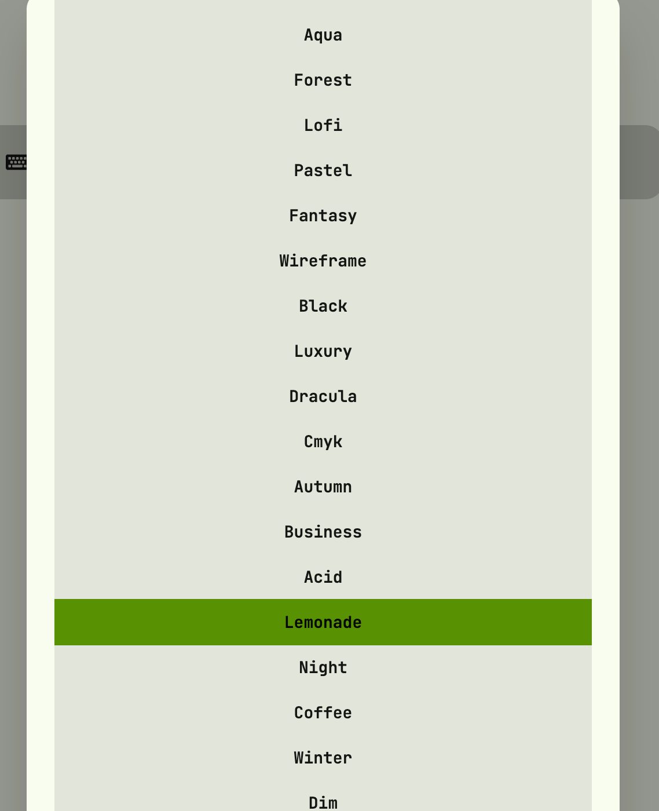
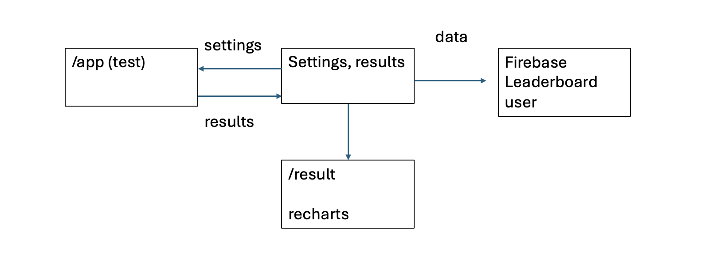

## Welcome to Your Next Galactic Adventure!

**Rocket Type** is a minimalistic typing app designed to help you improve your speed and accuracy while having fun! Compete for the top spot, track your progress, and blast off your typing skills to new heights.

## Give it a try here!
**[Live Demo](https://celestial-scribes.vercel.app)**

## 🚩 Features

- Multiple typing modes: Timed, Word Count, and free mode
- Clean, distraction-free interface
- Real-time stats: WPM, accuracy, errors, raw speed
- Leaderboards & personal progress tracking
- Color Themes Support (35 themes)
- Animated visual feedback and fun graphics

## ⌨ User Guide
- Select your settings and get ready to type!  

- Track your scores with detailed stats!

- See how you stack up against other players on the leaderboard

- Want a different look? Choose from 35 color themes and find one that suit your fancy!

## 🖥️ Tech Stack

#### Front-end
- React
    - Custom Hooks
- Next.js
- Tailwind
- Motion

#### Back-end and Database
- Vercel
- Firestore

#### UI/UX
- DaisyUI
- shadcn/ui
- Recharts
- React-icons

## Development Details

- The test settings, current test results, and login state are managed by a custom hook. Certain settings are only visible in certain game modes. 
- Once a test is completed, the result in the custom hook will be sent to the Firestore database via an async function.

## 📧 Contact
- My name is Austin Liao (廖祥廷). I am a front-end developer based in Taiwan. You can reach me via one of the methods below. Come and say hi!
- [E-mail](austin.ht.liao@gmail.com)
- [LinkedIn](https://www.linkedin.com/in/hsiang-ting-liao/)
