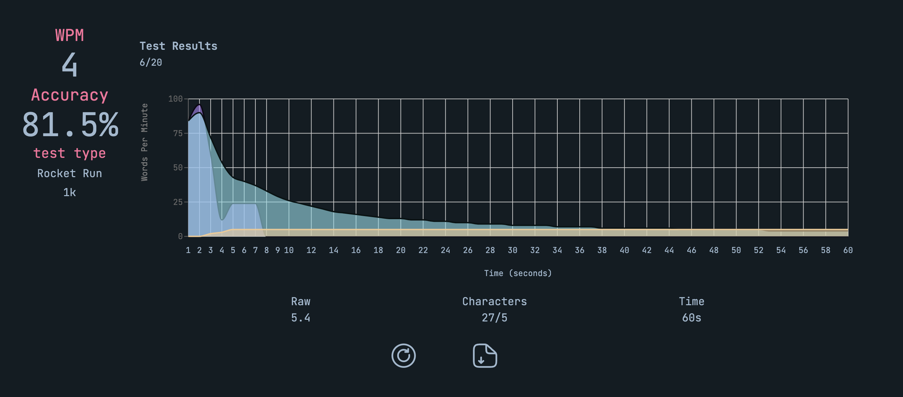
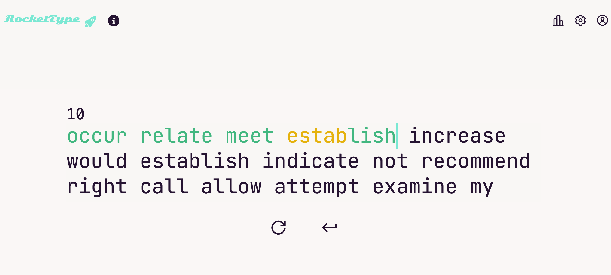

## Welcome to Your Next Galactic Adventure!

**Rocket Type** is a minimalistic typing app designed to help you improve your speed and accuracy while having fun! Compete for the top spot, track your progress, and blast off your typing skills to new heights.

## Give it a try here!
[Live Demo](https://celestial-scribes.vercel.app)

## 🚩 Features

- Multiple typing modes: Timed, Word Count, and free mode
- Clean, distraction-free interface
- Real-time stats: WPM, accuracy, errors, raw speed
- Leaderboards & personal progress tracking
- Color Themes Support (35 themes)
- Animated visual feedback and fun graphics

## 🖥️ Tech Stack

#### Front-end
- React
    - Custom Hooks
- Next.js
- Tailwind
- Motion

#### Back-end and Database
- Vercel
- Firestore

#### UI/UX
- DaisyUI
- shadcn/ui
- Recharts
- React-icons

## 📧 Contact
- My name is Austin Liao (廖祥廷). I am a front-end developer based in Taiwan. You can reach me via one of the methods. Come and say hi!
- [E-mail](austin.ht.liao@gmail.com)
- [LinkedIn](https://www.linkedin.com/in/hsiang-ting-liao/)
